# Personal Portfolio – Dipangkar Hajong

Welcome to my personal portfolio repository! This site showcases who I am as a Software Development Engineer, including my skills, projects, experience, and ways to get in touch. It's built to reflect my passion for coding, clean design, and solving real-world problems.

## Live Site

[idipangkar.netlify.app](https://idipangkar.netlify.app/)

## Desktop Version | Project Overview | Gallery

<p align="center">
  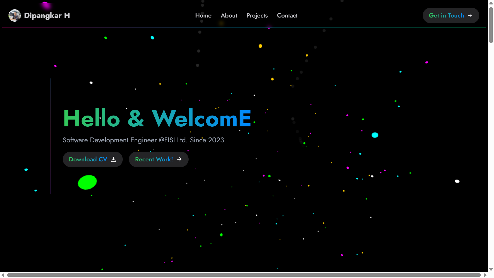
  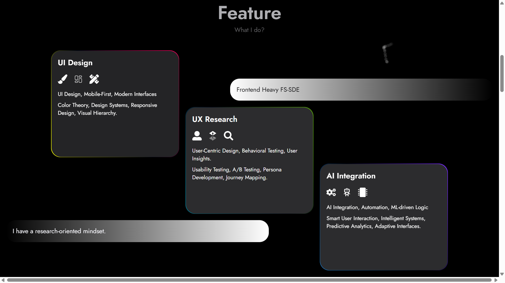
  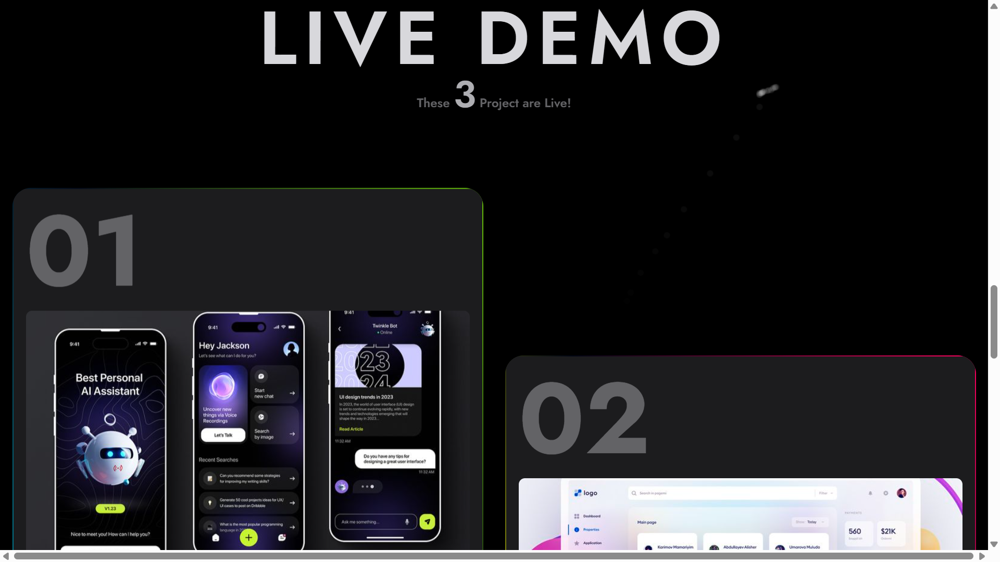
</p>
<p align="center">
  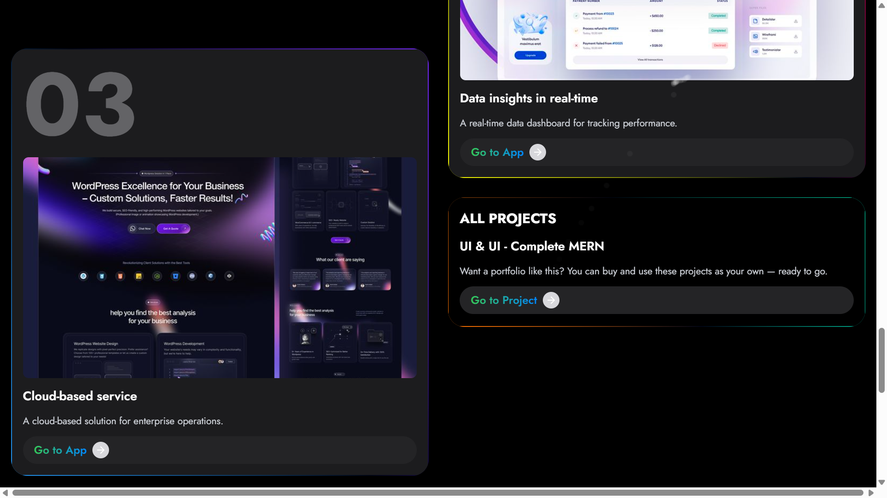
  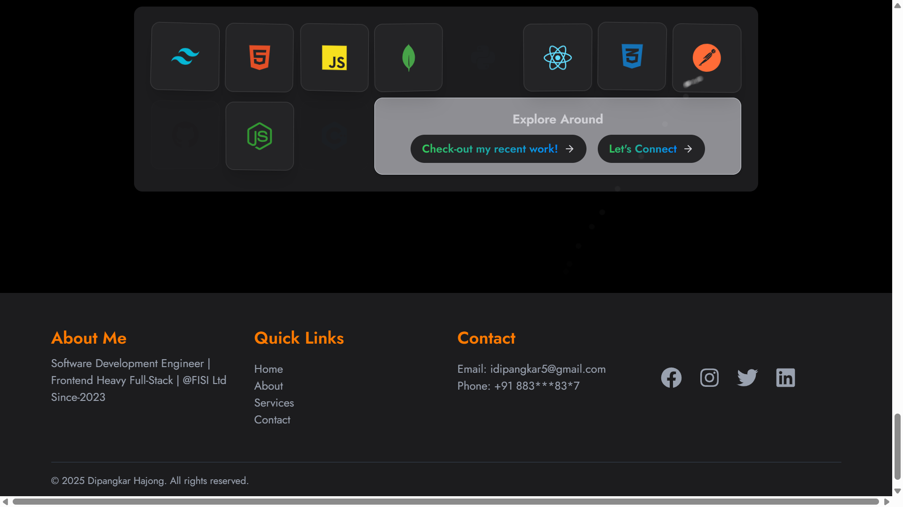

</p>

## Mobile Version | Project Overview | Gallery

<p align="center">
  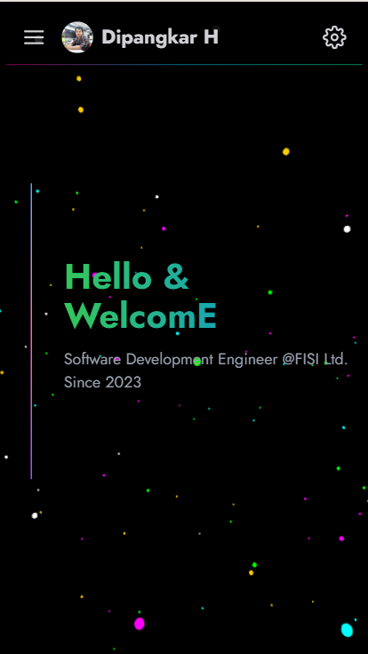
  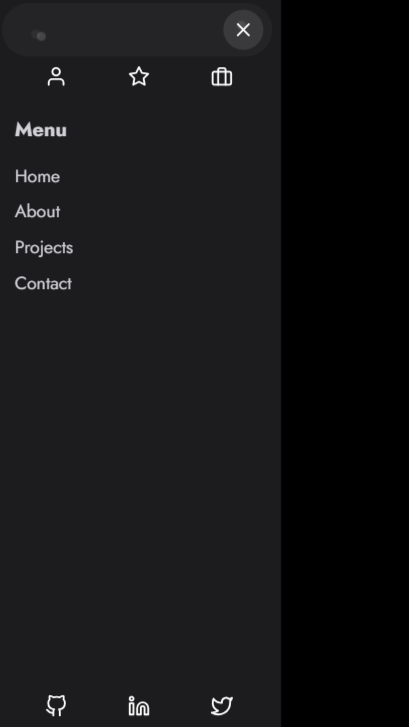
  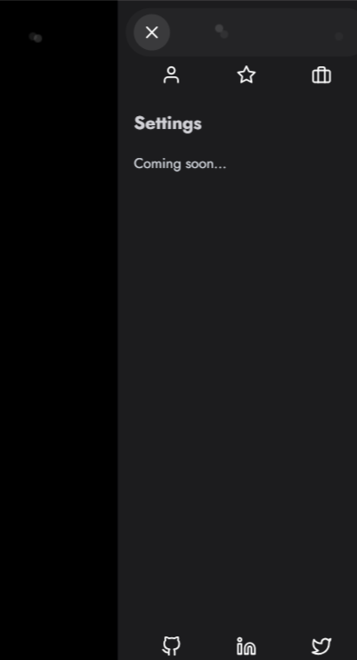
  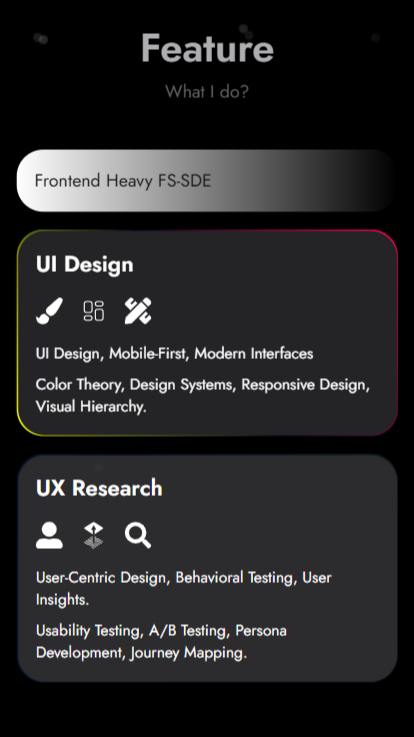
</p>
<p align="center">
  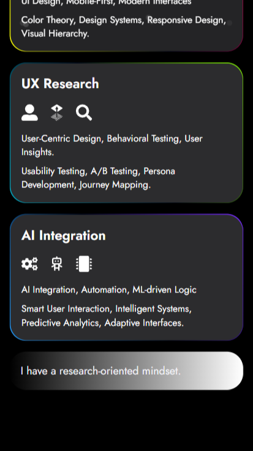
  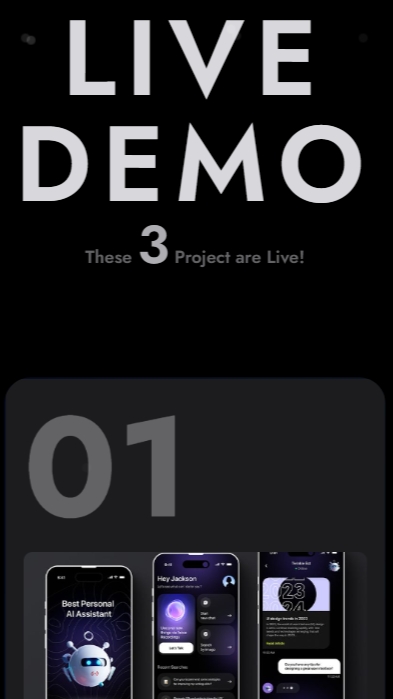
  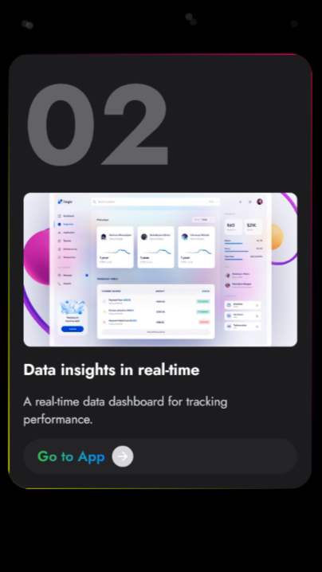
</p>
<p align="center">
  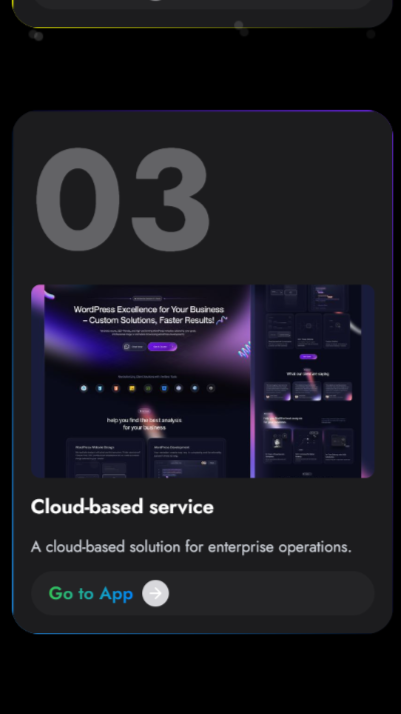
  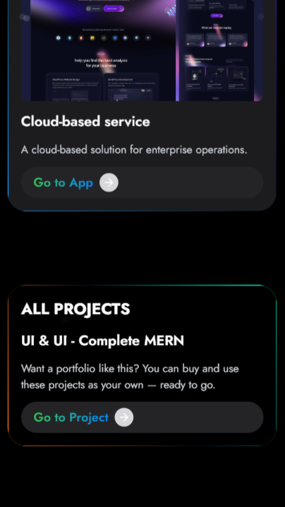
  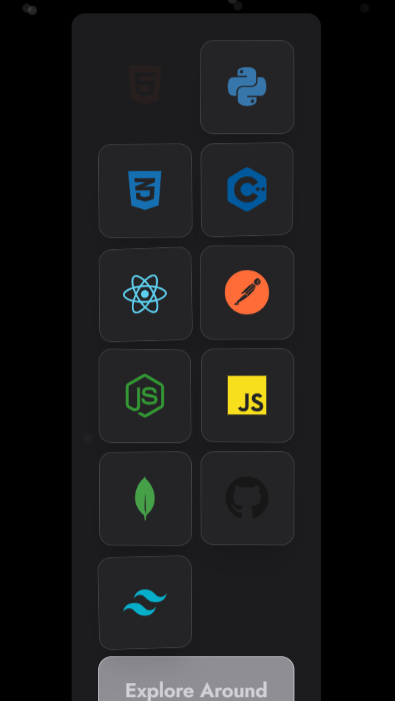
  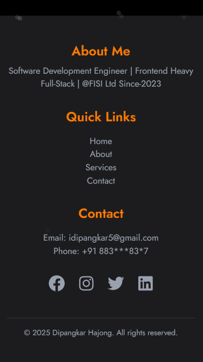
</p>

## Tech Stack

- **Frontend:** React.js / Next.js / HTML / CSS / Tailwind / Three / Motion / Parallax / Gsap
- **Backend:** Node.js / Express / REST APIs
- **Database:** MongoDB / Supabase
- **Deployment:** Vercel / Netlify / GitHub Pages / AWS
- **Others:** Git / Figma / Redux / React Query, Router Dom

## Features

- 👤 **About Me**: Software Engineer @Forrce Ltd – Since Nov 2023
- 💼 **Projects**: Real-world applications with live demos & GitHub links
- 🧠 **Skills**: React | Python | Frappe | ERPNext | C++ | JavaScript
- 📬 **Contact**: Integrated email form (idipangkar5@gmail.com)
- 🌗 **Dark/Light Mode** toggle
- 📱 **Fully Responsive** across all devices

---

## Folder Structure

**Note:** This is not the complete folder structure, but a high-level overview.

```
My-Portfolio-Web/
├── client/
│ ├── public/
│ │ └── assets/
│ ├── src/
│ │ ├── assets/
│ │ │ └── 3d/
│ │ │ └── images/
│ │ ├── components/
│ │ │ └── AboutDetail/      # AboutDetail Page
│ │ │ └── Common/           # Common & Reusable UI elements at Multi pages
│ │ │ └── ContactDetail/    # ContactDetail Page
│ │ │ └── Feature/          # Feature Specific UI elements
│ │ │ └── Footer/           # Main Footer UI elements for != all
│ │ │ └── Header/           # Main Header UI elements for all
│ │ │ └── ProjectDetail/
│ │ │ └── SkillCard/
│ │ ├── pages/              # Main pages
│ │ ├── sections/
│ │ ├── services/
│ │ └── ui/                 # Reusable UI elements
│ │ ├── app.jsx/
├── server/
README.md
```

## Getting Started Locally

### To clone and run this portfolio locally:

```bash
git clone https://github.com/idipangkar-ai/My-Portfolio-Web.git
cd My-Portfolio-Web
npm install
npm run dev
```

## Contribution

This is a personal project and not open to contributions at the moment. However, feedback and suggestions are always welcome!

## Contact Me

- **Portfolio:** [idipangkar.netlify.app](https://idipangkar.netlify.app)
- **Email:** idipangkar5@gmail.com
- **LinkedIn:** https://www.linkedin.com/in/idipangkar-ai/
- **GitHub:** [github.com/idipangkar-ai](https://github.com/idipangkar-ai)

## License

This project is licensed under the MIT License.
